# AxAIHub

**The AI hub of your Android phone — one AI assistant commanding your apps, files, tools, and devices, all on-device.**

**Possibly the most powerful AI agent on Android — today, and built for what comes next.**

[Download](#download) · [Install guide](docs/INSTALL.md) · [Verify your download](docs/VERIFY.md) · [FAQ](docs/FAQ.md) · [Privacy](PRIVACY.md)

**[简体中文说明 →](README.zh-CN.md)**

---

## What is AxAIHub

AxAIHub is the **AI hub of your Android phone** — far more than a chat interface. It is a unified platform where an AI assistant sits at the center of a suite of on-device tools — office documents, image editing, file management, project boards, notes, and small utilities — and can **directly operate them** through a local tool bus, with no cloud relay required.

Unlike most AI apps that are thin chat wrappers around cloud APIs, AxAIHub is built around a fundamentally different philosophy: **everything that can run locally, runs locally.** Cloud AI providers are entirely optional — you bring your own credentials and endpoints, or you run models fully offline using the on-device engine.

The app is built with **Tauri 2.0**, combining a native Android shell with a web-based UI layer, delivering a responsive experience while maintaining full access to device capabilities.

**Built-in depth that grows with you.** AxAIHub ships with a 35+ tool system across 9 capability domains, and its **runtime integration interface** lets you plug your own execution environments in on top of the runtimes already bundled (Python 3.11 built in, Termux optional) — the ceiling is set by you, not by us. System-level access (Shizuku/Root) stays strictly opt-in for those who need it. Automation and deeper system capabilities remain firmly on our roadmap — they take long-term refinement to build right, and restraint like skipping blind screen-tapping is a compliance choice for the long haul, not a lack of ambition.

---

## Architecture Overview

AxAIHub's architecture is designed around a **local tool bus** pattern, connecting the AI engine with all on-device tools through a unified command layer:

```mermaid
flowchart TB
    subgraph A[User Interaction Layer]
        U[User] --> UI[Unified Interface]
        UI --> UX[Core Interaction Experience]
        UX --> UX1[Long-press scroll<br>fine-grained line control]
        UX --> UX2[Single/double tap<br>quick navigation]
        UX --> UX3[Code folding<br>function/module collapse]
        UX --> UX4[Dual theme<br>day/night adaptive]
    end

    subgraph B[Frontend Application Layer]
        UI --> CHAT[Conversation Interface]
        UI --> CODE[Code Editor]
        UI --> PHOTO[Image Layer Editor]
        UI --> LEARN[Learning System]
        UI --> PROJECT[Project Management]
    end

    subgraph C[AI & Memory Layer]
        CHAT --> RAG[Retrieval Augmented Generation]
        RAG --> KB[Knowledge Base Integration]
        KB --> MEM[Memory Management]
        MEM --> M1[Sliding Window<br>current context]
        MEM --> M2[Recent conversation summaries]
        MEM --> M3[User profile cards]
        MEM --> M4[Session metadata]
        MEM --> M5[Cross-channel learning records]
    end

    subgraph D[Search & Browse Layer]
        CHAT --> BROWSER[In-app Browser]
        BROWSER --> SEARCH[AI-powered Search]
        SEARCH --> S1[Real-time web retrieval]
        SEARCH --> S2[Page content summarization]
        SEARCH --> S3[Inject results into conversation]
        S3 -->|inject| CHAT
    end

    subgraph E[Multi-architecture Dispatch Layer]
        CHAT --> AGENT[Master Agent<br>task decomposition]
        AGENT --> A1[Multi-agent Cluster]
        AGENT --> A2[ReAct Reasoning Chain]
        AGENT --> A3[Plan & Execute<br>long workflows]
        AGENT --> A4[Router + Skill<br>precise routing]
        A1 --> BB[Blackboard<br>shared state]
        A2 --> BB
        A3 --> BB
        A4 --> BB
        BB --> A5[Graph / Workflow<br>enterprise orchestration]
    end

    subgraph F[Tool & Plugin Layer]
        A1 --> T1[Tool Calling System<br>unified interface]
        A2 --> T1
        A3 --> T1
        A4 --> T1
        T1 --> T2[Plugin Loader<br>sandboxed isolation]
        T2 --> T3[Plugin Permissions<br>any module can invoke]
        T2 --> T4[Community Plugin Ecosystem]
        T3 --> CHAT
        T3 --> CODE
        T3 --> PHOTO
        T3 --> LEARN
    end

    subgraph G[Permission & System Layer]
        P1[Three-tier Permissions<br>Accessibility/Shizuku/Root] --> P2[Cross-app Control<br>simulated clicks/layout scan]
        P2 --> P3[Local File System]
        P1 --> P4[Device Hardware<br>Camera/NPU]
        CODE --> P3
        PHOTO --> P3
        PROJECT --> P3
    end

    subgraph H[External Connection Layer]
        A1 -->|lightweight| H1[Local Inference Engine<br>on-device models]
        A1 -->|complex| H2[Cloud LLM API]
        H2 --> H3[Provider-managed service]
    end

    subgraph I[Cross-app Communication Layer]
        IPC[AIDL IPC<br>cross-process interface] --> IPC1[AI as a Service<br>other apps request AI inference]
        IPC --> IPC2[ContentProvider<br>structured data sharing]
        IPC --> IPC3[BroadcastReceiver<br>event-driven async notifications]
        IPC1 --> CHAT
        IPC2 --> MEM
        IPC3 --> CHAT
    end

    subgraph J[Floating Ball System Layer]
        FLOAT[Global Overlay] --> F1[Screen Intelligence<br>OCR/layout analysis/intent]
        FLOAT --> F2[Quick Conversation Entry<br>global AI invocation]
        FLOAT --> F3[Assistant Operation Panel<br>gestures/quick actions]
        FLOAT --> F5[Game Scene Awareness<br>auto-disable disruptive overlays]
        FLOAT --> F6[AI-assisted Operation Engine<br>AccessibilityService]
        
        F6 --> F6A[Smart Input Assistant<br>auto-fill/text completion]
        F6 --> F6B[Visual Guide Click<br>highlight target + confirm]
        F6 --> F6C[Layout Semantic Parsing<br>interactive node recognition]
        F6 --> F6D[Operation Command Generation<br>NL to accessibility gestures]
        F6 --> F6E[Semi-automatic Execution<br>step-by-step pause / rollback]
        
        F1 --> SEARCH
        F2 --> CHAT
        F6 --> G
    end

    style UX fill:#f9a14b,stroke:#333,stroke-width:2px,color:#000
    style RAG fill:#4d96ff,stroke:#333,stroke-width:2px,color:#fff
    style KB fill:#b794f4,stroke:#333,stroke-width:2px,color:#fff
    style SEARCH fill:#6bcb77,stroke:#333,stroke-width:2px,color:#000
    style BROWSER fill:#ffd93d,stroke:#333,stroke-width:2px,color:#000
    style IPC fill:#ff6b6b,stroke:#333,stroke-width:2px,color:#fff
    style FLOAT fill:#845ec2,stroke:#333,stroke-width:2px,color:#fff
    style F6 fill:#ff6f91,stroke:#333,stroke-width:3px,color:#000
```

**Core architectural layers:**

| Layer | Technology | Role |
| --- | --- | --- |
| UI Layer | HTML/CSS/JS (WebView) | Renders all interfaces, supports theming |
| Tool Bus | Rust (Tauri 2.0 commands) | Mediates all tool calls, handles file I/O, manages state |
| AI Engine | On-device inference + Cloud proxy | Executes reasoning, routes tool calls, manages conversation context |
| Plugin System | Isolated WebView (axplugin://) | Sandboxed third-party extensions with permission model |
| Device Bridge | Android JNI + Bluetooth/WiFi | Connects to wearables, phones, and other devices |

---

## Key Features

### Built-in Tool System — 35+ tools, 9 capability domains

The AI doesn't just chat — it can **actually operate your phone** through a 35+ built-in tool system, grouped into 9 capability domains:

- **Web & Information (5)**: live web search, file-content search (grep), filename search, chat-attachment reading, audio extraction
- **File Operations (7)**: create / edit (full-file and line-level) / read / list / delete / rename / move files on your device
- **Terminal & Execution (2)**: full terminal (BusyBox 300+ commands, Android Shell, Termux) and Python execution
- **Multi-Agent Concurrency (2)**: concurrent multi-AI dispatch, parallel multi-tool scheduling
- **Image (2)**: on-device photo editing (filters & adjustments) and AI image generation
- **Tasks & Schedule (5)**: structured task plans (create/add/update), scheduled reminders with auto AI execution, structured question cards
- **Text & Encoding (12)**: base64, hash, timestamp, UUID, password, JSON, encode (10 formats), JWT, regex, text layout, text coloring, feedback
- **MCP (1+)**: external tool servers via the MCP protocol
- **Plugin System**: third-party plugin calling

This is the deepest on-device tooling available to an AI agent on Android — your assistant can search the web, write code, edit files, run terminals, and orchestrate multiple AI models in parallel, all on your phone.

### AI Assistant
- Works with any cloud AI provider you configure (OpenAI-compatible APIs, local inference endpoints)
- **Fully offline on-device engine** — download a model once, run inference locally with no network
- Semantic routing: automatically selects the best model for each task
- Concurrent multi-AI orchestration: dispatch sub-tasks to different models in parallel
- Context compression, memory management, and long-term recall

### Office Suite
- **Documents**: Rich text editing with Markdown support, rendered with KaTeX math and Mermaid diagrams
- **Tables**: Spreadsheet functionality with formulas and formatting
- **Notes**: Quick capture with media attachments
- **Text utilities**: OCR, format conversion, encoding/decoding tools
- **File conversion**: Between common document formats

### Image Editor
- On-device image editing with filters, adjustments, and effects
- Layout tools, crop, rotate, and export
- Project-based photo organization with galleries
- Supports common image formats

### File & Project Management
- Full file manager with breadcrumb navigation
- Project boards with per-day working files
- Folder and file operations (create, rename, move, delete)
- Multi-level directory tree with collapse/expand
- Built-in archive and backup support

### Terminal & Developer Tools
- Full terminal emulator with three execution layers:
  - **BusyBox** (300+ built-in commands, bundled with the app)
  - **Android Shell** (system commands)
  - **Termux** (optional, full Linux environment)
- Code editor with syntax highlighting (CodeMirror)
- NexusScript reference documentation

### Utilities
- Voice input with multi-engine support
- QR code scanning
- Floating ball quick-access overlay
- Small games (2048, Go board)
- Scheduled reminders with alarm manager persistence
- Text-to-speech (TTS) with auto-reading

---

## Feature Integration: How Everything Works Together

What makes AxAIHub different is not the individual features, but how they are **woven together** through the AI assistant:

### AI + Office
The AI assistant can directly create, edit, and format documents. You can say "summarize this document into a table" and the AI will open the office tool, create the table, and populate it — all without you switching apps.

### AI + Image Editor
The AI can describe what edits to make, or the image editor can feed visual context back to the AI for analysis. Ask "remove the background from this photo" and the AI routes the request to the appropriate tool.

### AI + File Manager
The AI navigates your file system, organizes projects, and manages backups. "Archive last month's project files" triggers the file manager through the tool bus.

### AI + Terminal
The AI can execute terminal commands, interpret output, and suggest next steps. This creates a powerful development workflow: describe what you want to build, and the AI handles the command-line work.

### AI + Plugin System
Third-party plugins register their capabilities with the tool bus. The AI discovers and invokes them dynamically, extending its reach to whatever functionality plugins provide.

### Cross-Feature Workflows
A single user request can cascade through multiple tools:
1. User: "Create a project report from last week's notes, add charts, and save it as PDF"
2. AI parses intent, calls the file manager to locate notes
3. Routes to the office tool to compile the document
4. Invokes the image editor to generate charts
5. Exports the final PDF

All of this happens **on-device**, with no data leaving your phone unless you've configured a cloud AI provider.

---

## Multi-Device Connectivity

AxAIHub supports connecting to other devices through multiple channels:

### Bluetooth Devices
- Pair with wearables, smart bands, and IoT devices
- Cross-device control: send commands from your phone, receive sensor data
- Health data integration from connected wearables

### Nearby WiFi
- Discover and connect to devices on the same network
- File sharing between AxAIHub instances
- Collaborative editing across devices

### Phone-to-Phone
- Direct connection between two AxAIHub instances
- Shared clipboard and task delegation
- Synchronized AI context across devices

All connections are **encrypted and peer-to-peer**. There is no central server, and your data never passes through a third-party relay.

---

## Privacy & Data Sovereignty

- **No account required.** Core features work without any login or registration.
- **No telemetry.** The app collects no usage statistics, crash reports, or analytics.
- **No data upload.** Your conversations, documents, images, and files stay in local storage.
- **Your AI, your credentials.** If you use a cloud AI provider, requests go directly to the endpoint you configured, under your credentials — never through our infrastructure.
- **Local web service** binds to loopback address only, unreachable from outside the device.
- Full privacy policy: [PRIVACY.md](PRIVACY.md)
- Permission-by-permission breakdown: [docs/PERMISSIONS.md](docs/PERMISSIONS.md)

---

## Plugin System

AxAIHub features an **open plugin format** that allows third-party developers to extend the app's capabilities. The plugin system is fully open-source and documented in the [axaihub-plugin-system](https://github.com/AllyXplore/axaihub-plugin-system) repository.

- **Package formats**: plain and encrypted formats
- **Sandbox isolation**: Each plugin runs in its own WebView with a unique origin (axplugin://<plugin-id>), preventing cross-plugin data access
- **Permission model**: Plugins request permissions through Android's native API
- **Resource management**: Inactive plugins are unloaded to prevent memory leaks
- **Lifecycle**: Plugins are loaded on demand and released when not in use

The plugin format specification, packaging CLI (`axbuild`), and complete documentation are open-source at [github.com/AllyXplore/axaihub-plugin-system](https://github.com/AllyXplore/axaihub-plugin-system).

---

## Download

Official releases are published as attachments on the release page below:

| Source | Link |
| --- | --- |
| GitHub | https://github.com/AllyXplore/AxAIHub/releases/latest |

Installer file name pattern: AxAIHub-<version>-aarm64-v8a.apk

Only files downloaded from the page above are official. Every release lists a SHA-256 checksum and the signing certificate fingerprint — please check them before installing. See [docs/VERIFY.md](docs/VERIFY.md).

---

## Requirements

- **Android**: 7.0 (API level 24) or newer
- **CPU**: 64-bit ARM only (arm64-v8a). 32-bit ARM and x86 are not supported
- **Storage**: ~120 MB for the app itself
- **RAM** (optional, for offline AI engine): 6 GB or more recommended, plus space for downloaded model files

---

## Install & Upgrade

**Install**: Download the APK, allow installation from your browser or file manager when prompted, then open it. Full walkthrough (including "unknown source" prompts on various Android skins) is in **[docs/INSTALL.md](docs/INSTALL.md)**.

**Upgrade**: Install the new version directly over the old one. Do **not** uninstall first — uninstalling removes all local data.

---

## About This Repository

This is the **distribution and documentation** repository for AxAIHub. It contains:

`
.
├── docs/                 Install guide, verification, permissions, FAQ, release notes template
├── assets/               App icon, screenshots, and documentation assets
├── CHANGELOG.md          Version history
├── CODE_OF_CONDUCT.md    Community guidelines
├── CONTRIBUTING.md       How to contribute (note: code contributions not accepted)
├── LICENSE               End-user license agreement, disclaimer, trademark notice
├── PRIVACY.md            Complete privacy policy
├── SECURITY.md           How to report security vulnerabilities
├── SUPPORT.md            Support channels and scope
├── THIRD-PARTY-NOTICES.md  Open-source components and their licenses
├── README.md             This file (English)
└── README.zh-CN.md       Chinese version of this file
`

**The application source code is not published here.** AxAIHub is proprietary software maintained by a very small team. Third-party open-source components used in the app are credited in [THIRD-PARTY-NOTICES.md](THIRD-PARTY-NOTICES.md).

The plugin format specification, packaging CLI (`axbuild`), and documentation are **open-source** in the [axaihub-plugin-system](https://github.com/AllyXplore/axaihub-plugin-system) repository.

---

## Feedback & Support

- **Bug reports & feature requests**: [Open an issue](https://github.com/AllyXplore/AxAIHub/issues/new/choose)
- **Security issues**: Follow [SECURITY.md](SECURITY.md) — do not open a public issue
- **Community**: [QQ Group](https://pd.qq.com/qqweb/qunpro/share?_wv=3&_wwv=128&appChannel=share&attaContentID=7824cc8ef7d54615a238e9f4ee7f38eb&biz=ka&businessType=5&from=246611&inviteCode=2LWrRnNgUhY&mainSourceId=qr_code&subSourceId=pic4&b=5)
- **Support policy**: [SUPPORT.md](SUPPORT.md)

---

## Legal

Copyright (c) 2026 AllyXplore. All rights reserved.

AxAIHub is provided "as is", without warranty of any kind. "AxAIHub" and "AllyXplore" are names created and used by the developer; the rights in these names belong to the developer and they may not be used for other products without permission. Read [LICENSE](LICENSE) before installing.

AxAIHub · local-first · privacy-respecting · maintained by Ax丶现 (AllyXplore)

