# AxAIHub

**本地优先的安卓 AI 工作台 —— AI 助手、办公套件、图片编辑器、文件管理器与开放插件体系，全部在你的设备上运行。**

[下载](#下载) · [安装说明](docs/INSTALL.md) · [校验安装包](docs/VERIFY.md) · [常见问题](docs/FAQ.md) · [隐私政策](PRIVACY.md)

**[English →](README.md)**

---

## 这是什么

AxAIHub 是一个**本地优先的 AI 工作台**，远不止是一个简单的聊天界面。它是一个统一的平台：AI 助手位于核心，周围环绕着一整套设备端工具——文档、图片编辑、文件管理、项目看板、笔记和小工具——并通过**本地工具总线**直接操控它们，无需任何云端中转。

与大多数仅是云端 API 的聊天外壳的 AI 应用不同，AxAIHub 围绕一个根本不同的理念构建：**能在本地跑的就本地跑。** 云端 AI 服务完全可选——你自带凭据和接口地址，或者使用设备端引擎完全离线运行模型。

应用基于 **Tauri 2.0** 构建，将原生 Android 外壳与基于 Web 的 UI 层结合，在保持对设备能力的完全访问的同时提供流畅的体验。

---

## 架构总览

AxAIHub 的架构围绕**本地工具总线**模式设计：

```mermaid
flowchart TB
    subgraph A[用户交互层]
        U[用户] --> UI[统一界面]
        UI --> UX[基础交互体验]
        UX --> UX1[长按滚动<br>内容逐行精细控制]
        UX --> UX2[单击/双击传送<br>快速跳转定位]
        UX --> UX3[代码折叠<br>函数/模块级收起展开]
        UX --> UX4[双色主题<br>日间/夜间自适应]
    end

    subgraph B[前端应用层]
        UI --> CHAT[对话调度界面]
        UI --> CODE[代码编辑器]
        UI --> PHOTO[图片图层编辑器]
        UI --> LEARN[学习系统]
        UI --> PROJECT[项目管理]
    end

    subgraph C[AI与记忆层]
        CHAT --> RAG[检索增强生成]
        RAG --> KB[知识库链接<br>外部知识源接入]
        KB --> MEM[记忆管理]
        MEM --> M1[滑动窗口<br>当前上下文]
        MEM --> M2[近期对话摘要<br>轻量话题]
        MEM --> M3[用户结构化档案卡]
        MEM --> M4[会话元数据<br>时区/设备]
        MEM --> M5[跨渠道学习记录<br>共享记忆]
    end

    subgraph D[搜索与浏览层]
        CHAT --> BROWSER[内置浏览器]
        BROWSER --> SEARCH[AI即时搜索]
        SEARCH --> S1[联网实时检索]
        SEARCH --> S2[页面内容智能摘要]
        SEARCH --> S3[搜索结果注入对话上下文]
        S3 -->|注入| CHAT
    end

    subgraph E[多架构混合调度层]
        CHAT --> AGENT[总控Agent<br>任务拆解分发]
        AGENT --> A1[多智能体集群]
        AGENT --> A2[ReAct 推理链]
        AGENT --> A3[Plan&Execute 长流程]
        AGENT --> A4[Router+Skill 精准路由]
        A1 --> BB[Blackboard 共享状态]
        A2 --> BB
        A3 --> BB
        A4 --> BB
        BB --> A5[Graph/Workflow 企业级流程]
    end

    subgraph F[工具与插件层]
        A1 --> T1[工具调用系统 统一接口]
        A2 --> T1
        A3 --> T1
        A4 --> T1
        T1 --> T2[插件加载器<br>沙箱隔离]
        T2 --> T3[插件通用影响<br>所有模块可调用]
        T2 --> T4[社区插件生态]
        T3 --> CHAT
        T3 --> CODE
        T3 --> PHOTO
        T3 --> LEARN
    end

    subgraph G[权限与系统层]
        P1[三层权限<br>无障碍/Shizuku/Root] --> P2[跨App操控<br>模拟点击/布局扫描]
        P2 --> P3[本地文件系统]
        P1 --> P4[手机硬件<br>摄像头/NPU]
        CODE --> P3
        PHOTO --> P3
        PROJECT --> P3
    end

    subgraph H[外部连接层]
        A1 -->|轻量| H1[本地推理引擎<br>本地模型]
        A1 -->|复杂| H2[云端大模型 API]
        H2 --> H3[服务商托管模式]
    end

    subgraph I[跨应用通信层]
        IPC[AIDL IPC 跨进程接口] --> IPC1[AIaaS 能力开放<br>其他App可请求AI推理]
        IPC --> IPC2[ContentProvider 数据共享<br>结构化数据读写]
        IPC --> IPC3[BroadcastReceiver 事件驱动<br>异步任务通知与回调]
        IPC1 --> CHAT
        IPC2 --> MEM
        IPC3 --> CHAT
    end

    subgraph J[悬浮球系统层]
        FLOAT[全局悬浮窗 Overlay] --> F1[屏幕智能识屏<br>OCR/布局分析/意图理解]
        FLOAT --> F2[快捷对话入口<br>全局唤起AI助手]
        FLOAT --> F3[辅助操作面板<br>手势/快捷动作]
        FLOAT --> F5[游戏场景感知<br>自动降级/禁用干扰弹窗]
        FLOAT --> F6[AI辅助操作引擎<br>基于AccessibilityService]
        
        F6 --> F6A[智能输入辅助<br>自动填充/文本补全/表单录入]
        F6 --> F6B[视觉引导点击<br>高亮目标元素+确认后执行]
        F6 --> F6C[布局语义解析<br>识别可交互节点/坐标映射]
        F6 --> F6D[操作指令生成<br>自然语言转无障碍手势]
        F6 --> F6E[半自动执行模式<br>逐步骤暂停/人工干预/安全回滚]
        
        F1 --> SEARCH
        F2 --> CHAT
        F6 --> G
    end

    style UX fill:#f9a14b,stroke:#333,stroke-width:2px,color:#000
    style RAG fill:#4d96ff,stroke:#333,stroke-width:2px,color:#fff
    style KB fill:#b794f4,stroke:#333,stroke-width:2px,color:#fff
    style SEARCH fill:#6bcb77,stroke:#333,stroke-width:2px,color:#000
    style BROWSER fill:#ffd93d,stroke:#333,stroke-width:2px,color:#000
    style IPC fill:#ff6b6b,stroke:#333,stroke-width:2px,color:#fff
    style FLOAT fill:#845ec2,stroke:#333,stroke-width:2px,color:#fff
    style F6 fill:#ff6f91,stroke:#333,stroke-width:3px,color:#000
```

**核心架构层：**

| 层 | 技术 | 作用 |
| --- | --- | --- |
| UI 层 | HTML/CSS/JS (WebView) | 渲染所有界面，支持主题切换 |
| 工具总线 | Rust (Tauri 2.0 命令) | 协调所有工具调用，处理文件 I/O，管理状态 |
| AI 引擎 | 设备端推理 + 云端代理 | 执行推理，路由工具调用，管理对话上下文 |
| 插件系统 | 隔离沙箱（独立源） | 沙箱化的第三方扩展，带权限模型 |
| 设备桥接 | Android JNI + 蓝牙/WiFi | 连接可穿戴设备、手机和其他设备 |

---

## 主要功能

### AI 助手
- 支持你配置的任何云端 AI 服务（兼容 OpenAI 的 API、本地推理端点）
- **完全离线的设备端引擎**——模型文件下载一次后，本地推理完全不需要网络
- 语义路由：自动为每个任务选择最佳模型
- 并发多 AI 编排：将子任务并行分派给不同模型
- 上下文压缩、记忆管理和长期记忆

### 办公套件
- **文档**：富文本编辑，支持 Markdown、KaTeX 数学公式和 Mermaid 图表
- **表格**：电子表格功能，支持公式和格式化
- **笔记**：快速记录，支持媒体附件
- **文本工具**：OCR、格式转换、编码/解码工具
- **文件转换**：常见文档格式之间的互转

### 图片编辑器
- 设备端图片编辑，支持滤镜、调整和特效
- 排版工具、裁剪、旋转和导出
- 基于项目的照片组织与图库
- 支持常见图片格式

### 文件与项目管理
- 完整文件管理器，带面包屑导航
- 项目看板，按日期组织工作文件
- 文件夹和文件操作（创建、重命名、移动、删除）
- 多级目录树，支持折叠/展开
- 内置归档和备份支持

### 终端与开发者工具
- 完整终端模拟器，三层执行引擎：
  - **BusyBox**（300+ 内置命令，随应用打包）
  - **Android Shell**（系统命令）
  - **Termux**（可选，完整 Linux 环境）
- 代码编辑器，支持语法高亮（CodeMirror）
- NexusScript 参考文档

### 实用工具
- 语音输入，支持多引擎
- 二维码扫描
- 悬浮球快捷入口
- 小游戏（2048、围棋棋盘）
- 定时提醒，支持闹钟管理器持久化
- 文字转语音（TTS），支持自动朗读

---

## 功能协同：一切如何配合工作

AxAIHub 的不同之处不在于单个功能，而在于它们如何通过 AI 助手**编织在一起**：

### AI + 办公
AI 助手可以直接创建、编辑和格式化文档。你可以说"把这份文档总结成表格"，AI 就会打开办公工具、创建表格并填入内容——全程无需切换应用。

### AI + 图片编辑器
AI 可以描述要做的编辑，或者图片编辑器可以将视觉上下文反馈给 AI 分析。说"把这张照片的背景去掉"，AI 就会将请求路由到相应的工具。

### AI + 文件管理器
AI 可以浏览文件系统、组织项目、管理备份。"把上个月的项目文件归档"会通过工具总线触发文件管理器。

### AI + 终端
AI 可以执行终端命令、解释输出、建议下一步操作。这创建了一个强大的开发工作流：描述你想构建什么，AI 处理命令行工作。

### AI + 插件系统
第三方插件向工具总线注册其能力。AI 动态发现并调用它们，将能力延伸到插件提供的任何功能。

### 跨功能工作流
单个用户请求可以级联通过多个工具：
1. 用户："用上周的笔记创建一份项目报告，添加图表，保存为 PDF"
2. AI 解析意图，调用文件管理器定位笔记
3. 路由到办公工具编译文档
4. 调用图片编辑器生成图表
5. 导出最终 PDF

这一切都在**设备端**完成，除非你配置了云端 AI 服务，否则数据不会离开你的手机。

---

## 多设备互联

AxAIHub 支持通过多种渠道连接其他设备：

### 蓝牙设备
- 与可穿戴设备、智能手环和 IoT 设备配对
- 跨设备控制：从手机发送命令，接收传感器数据
- 连接可穿戴设备的健康数据集成

### 附近 WiFi
- 发现并连接到同一网络上的设备
- 在 AxAIHub 实例之间共享文件
- 跨设备协同编辑

### 手机到手机
- 两个 AxAIHub 实例之间的直接连接
- 共享剪贴板和任务委派
- 跨设备同步 AI 上下文

所有连接都是**加密且点对点的**。没有中央服务器，你的数据不会经过第三方中转。

---

## 隐私与数据主权

- **不需要账号。** 核心功能无需任何登录或注册。
- **无遥测。** 应用不收集任何使用统计、崩溃报告或分析数据。
- **不上传数据。** 你的对话、文档、图片和文件保存在本地存储中。
- **你的 AI，你的凭据。** 如果你使用云端 AI 服务，请求直接发往你配置的接口，使用你自己的凭据——绝不经过我们的基础设施。
- **本地网络服务**仅监听回环地址，设备外部无法访问。
- 完整隐私政策：[PRIVACY.md](PRIVACY.md)
- 逐项权限说明：[docs/PERMISSIONS.md](docs/PERMISSIONS.md)

---

## 插件体系

AxAIHub 拥有一个**开放的插件格式**，允许第三方开发者扩展应用能力。插件体系完全开源，文档见 [axaihub-plugin-system](https://github.com/AllyXplore/axaihub-plugin-system) 仓库。

- **包格式**：（明文和加密两种格式）
- **沙箱隔离**：每个插件在自己的 WebView 中运行，使用独立源（axplugin://<插件ID>），防止跨插件数据访问
- **权限模型**：插件通过 Android 原生 API 请求权限
- **资源管理**：非活跃插件被卸载以防止内存泄漏
- **生命周期**：插件按需加载，不用时释放

插件格式规范、打包 CLI（`axbuild`）和完整文档已在 [github.com/AllyXplore/axaihub-plugin-system](https://github.com/AllyXplore/axaihub-plugin-system) 开源。

---

## 下载

正式版本以附件形式发布在下面的发行版页面：

| 来源 | 地址 |
| --- | --- |
| GitHub | https://github.com/AllyXplore/AxAIHub/releases/latest |

安装包文件名规则：AxAIHub-<版本号>-arm64-v8a.apk

只有从上面页面下载的文件才是官方版本。每个发行版都会公布安装包的 SHA-256 校验值和签名证书指纹，安装前请先核对，方法见 [docs/VERIFY.md](docs/VERIFY.md)。

---

## 运行要求

- **Android**：7.0（API 级别 24）及以上
- **CPU**：仅 64 位 ARM（rm64-v8a）。不支持 32 位 ARM 和 x86
- **存储**：应用本身约需 120 MB
- **内存**（可选，用于离线 AI 引擎）：建议 6 GB 及以上，另需为下载的模型文件预留空间

---

## 安装与升级

**安装**：下载 APK，系统询问时允许来自浏览器或文件管理器的安装，然后打开它。完整步骤（含各家 Android 系统的"未知来源"提示处理）见 **[docs/INSTALL.md](docs/INSTALL.md)**。

**升级**：直接覆盖安装新版本，不要先卸载——卸载会删除所有本地数据。

---

## 关于本仓库

这里是 AxAIHub 的**分发与文档**仓库，包含：

`
.
├── docs/                 安装指南、校验、权限、常见问题、发行说明模板
├── assets/               APP 图标、截图和文档资源
├── CHANGELOG.md          版本历史
├── CODE_OF_CONDUCT.md    社区行为准则
├── CONTRIBUTING.md       贡献指南（注意：不接受代码贡献）
├── LICENSE               最终用户许可协议、免责声明、商标说明
├── PRIVACY.md            完整隐私政策
├── SECURITY.md           安全漏洞报告方式
├── SUPPORT.md            支持渠道和范围
├── THIRD-PARTY-NOTICES.md  第三方开源组件及其许可证
├── README.md             本文件英文版
└── README.zh-CN.md       本文件中文版
`

**应用源代码不在此处公开。** AxAIHub 是由极小团队维护的闭源软件。应用所用到的第三方开源组件在 [THIRD-PARTY-NOTICES.md](THIRD-PARTY-NOTICES.md) 中列出并致谢。

插件格式规范、打包 CLI（`axbuild`）和文档已在 [axaihub-plugin-system](https://github.com/AllyXplore/axaihub-plugin-system) 仓库**开源**。

---

## 反馈与支持

- **缺陷报告与功能建议**：[提交 Issue](https://github.com/AllyXplore/AxAIHub/issues/new/choose)
- **安全问题**：请按 [SECURITY.md](SECURITY.md) 私下反馈，不要公开提交
- **社区**：[QQ 群](https://pd.qq.com/qqweb/qunpro/share?_wv=3&_wwv=128&appChannel=share&attaContentID=7824cc8ef7d54615a238e9f4ee7f38eb&biz=ka&businessType=5&from=246611&inviteCode=2LWrRnNgUhY&mainSourceId=qr_code&subSourceId=pic4&b=5)
- **支持范围**：[SUPPORT.md](SUPPORT.md)

---

## 法律声明

Copyright (c) 2026 AllyXplore. 保留所有权利。

本软件"按现状"提供，不附带任何形式的担保。"AxAIHub"与"AllyXplore"为开发者独创并使用的名称，相关名称权益归开发者所有，未经许可不得用于其他产品。安装前请阅读 [LICENSE](LICENSE)。

AxAIHub · 本地优先 · 尊重隐私 · 由 Ax丶现（AllyXplore）维护

